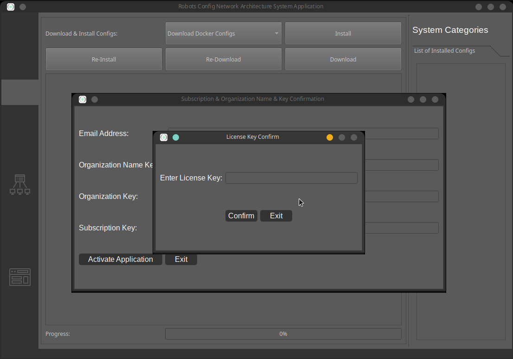
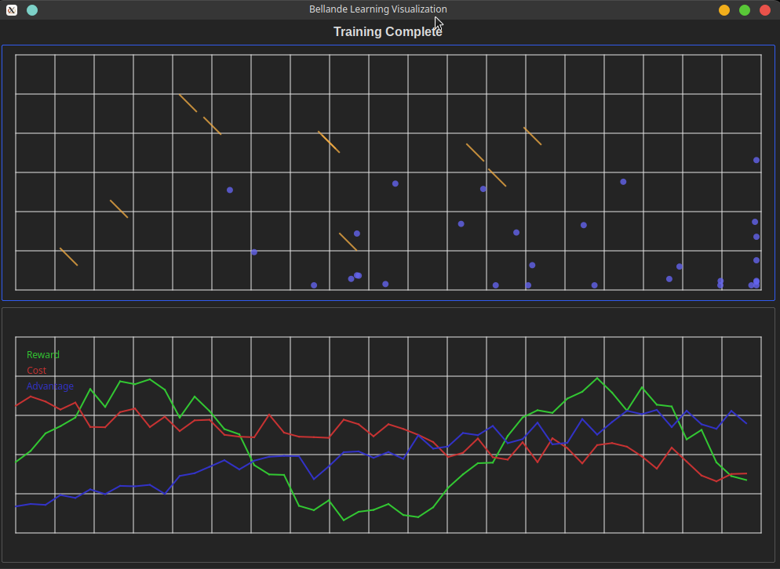

# 📦 Bellande Learning API
- Use Bellande API's to get the result below

# Bellande Application 
- ```One of the features of Bellande Application is to install API's and use API locally without internet for Robotic Purposes or other Applications```



- https://git.bellande-technologies.com/BAICVRI/bellande_learning
- https://github.com/Artificial-Intelligence-Computer-Vision/bellande_learning
- https://gitlab.com/Bellande-Artificial-Intelligence-Computer-Vision-Research-Inovations-Center/bellande_learning
- https://bitbucket.org/Bellande-Artificial-Intelligence-Computer-Vision/bellande_learning

# BL(Bellande Learning) Algorithm API
## Bellande Probability Calculations
- https://git.bellande-technologies.com/BAICVRI/bellande_probability
- https://github.com/Robotics-Sensors/bellande_probability
- https://gitlab.com/Bellande-Robotics-Sensors-Research-Innovation-Center/bellande_probability
- https://bitbucket.org/Bellande-Robotics-Sensors/bellande_probability

## Bellande Tree Node Calculations
- https://git.bellande-technologies.com/BAICVRI/bellande_tree_node
- https://github.com/Artificial-Intelligence-Computer-Vision/bellande_tree_node
- https://gitlab.com/Bellande-Artificial-Intelligence-Computer-Vision-Research-Inovations-Center/bellande_tree_node
- https://bitbucket.org/Bellande-Artificial-Intelligence-Computer-Vision/bellande_tree_node

## Bellande Control System Calculations
- https://git.bellande-technologies.com/BAICVRI/bellande_control_system
- https://github.com/Artificial-Intelligence-Computer-Vision/bellande_control_system
- https://gitlab.com/Bellande-Artificial-Intelligence-Computer-Vision-Research-Inovations-Center/bellande_control_system
- https://bitbucket.org/Bellande-Artificial-Intelligence-Computer-Vision/bellande_control_system




## License
This Algorithm or Models is distributed under the [Creative Commons Attribution-ShareAlike 4.0 International License](http://creativecommons.org/licenses/by-sa/4.0/), see [LICENSE](https://github.com/Artificial-Intelligence-Computer-Vision/bellande_learning/blob/main/LICENSE) and [NOTICE](https://github.com/Artificial-Intelligence-Computer-Vision/bellande_learning/blob/main/LICENSE) for more information.
